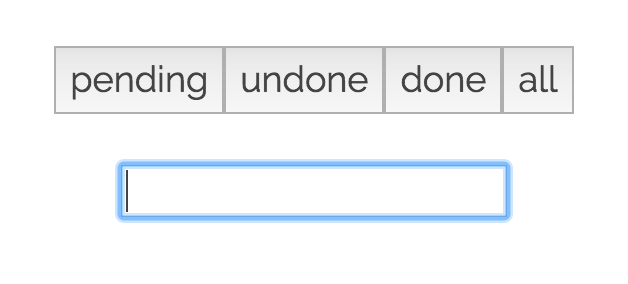

##Simple To-Do List

Built with [React](https://facebook.github.io/react/) for views & [Backbone](http://backbonejs.org/) for routing.

Add items to the list by typing them in the input. Change status by selecting from the dropdown. Items can be deleted by clicking the delete button at the end of each row. Toggle between different views by selecting the corresponding view button at the top.

Enjoy! 🍕

